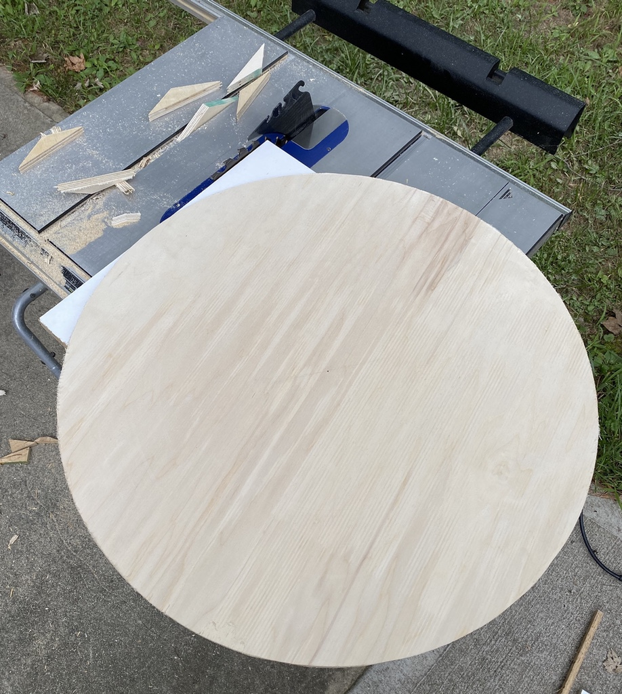
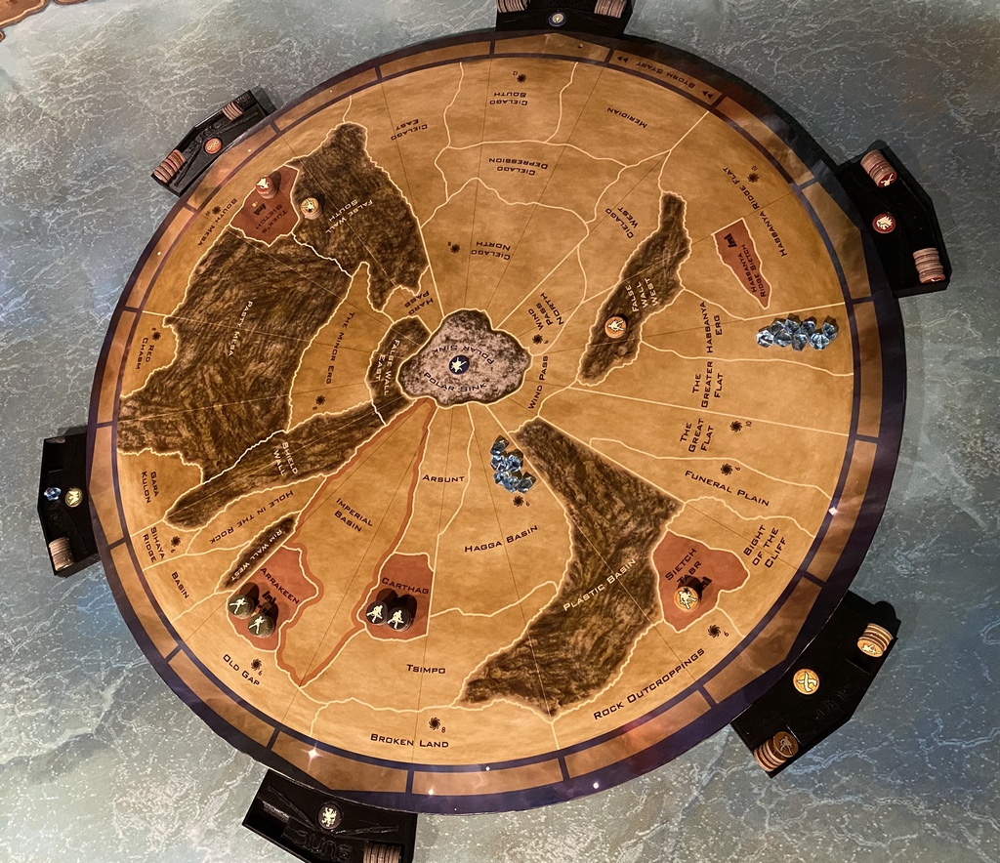
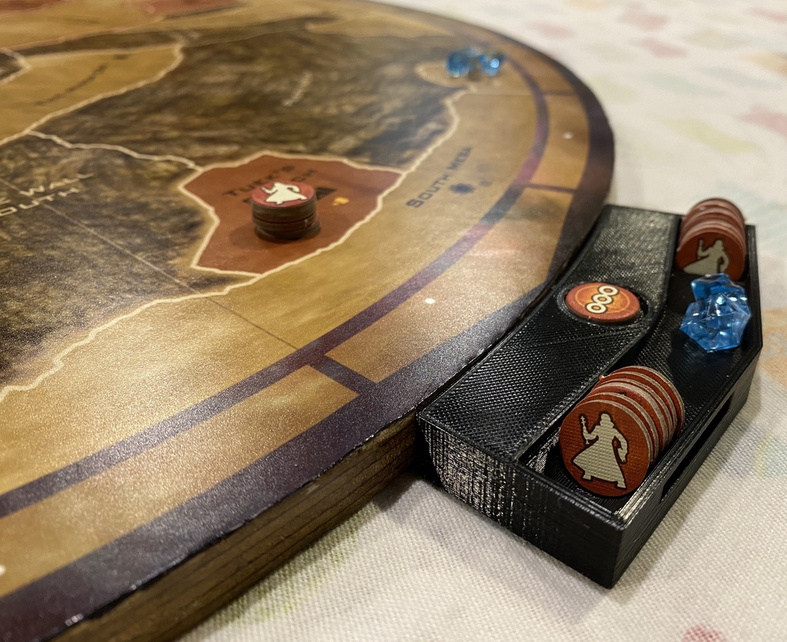
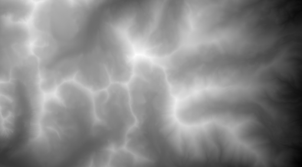
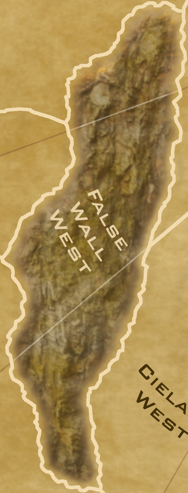
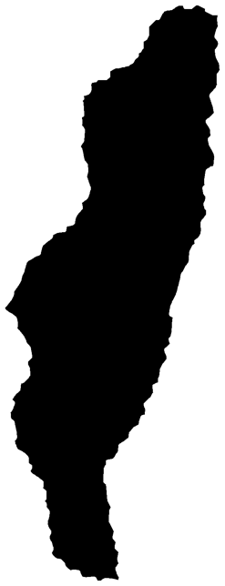
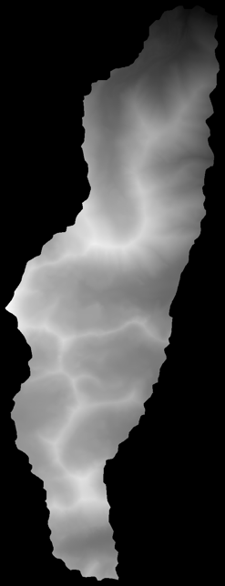
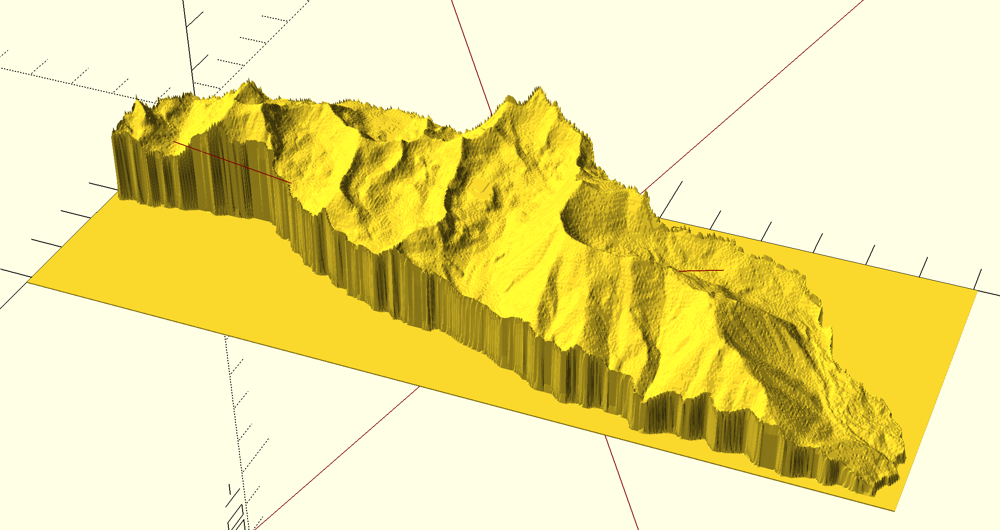
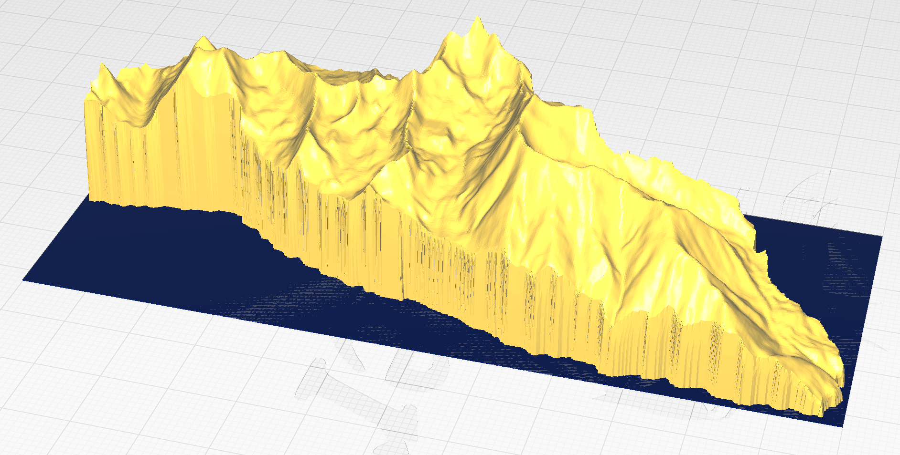

# Dune Mountains

Creating the best Dune board game map ever...

I started with [ScottE's map](https://boardgamegeek.com/thread/531160/scotts-dune-build-project)
as I've played on a print of this board for 10+ years.

I learned to cut a circular board on my table saw:

Took a modified version of the map, had it printed poster-sized, glued it on, and cut to fit:

3d-printed player holders that slide onto the board and are movable for more or fewer players:

But next ... I want to print mountains to attach to the board and make it fully 3d.

## 1. Image Editing Attempt

Started with some heightmaps found from https://tangrams.github.io/heightmapper/

Like this:

I take a mountain section of the board:

Mask out the piece that I need:

And crop out the heightmap to fit in that section:

OpenSCAD is a bit slow to work with it, but looks ok:

Just opening it directly in Cura is actually pretty controllable:

But what I really need is mountains shaped to the territory, sloping down to the edges naturally.

